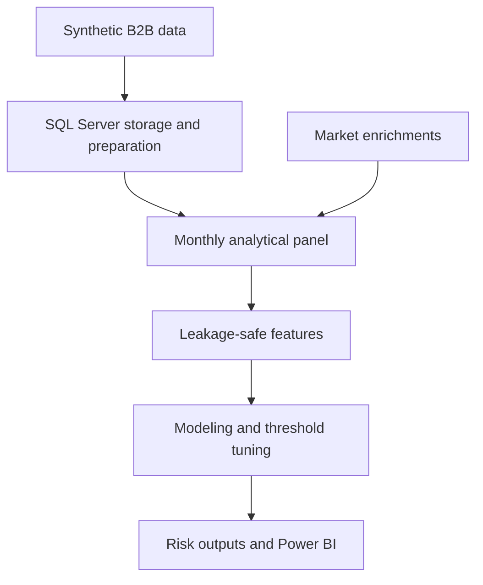
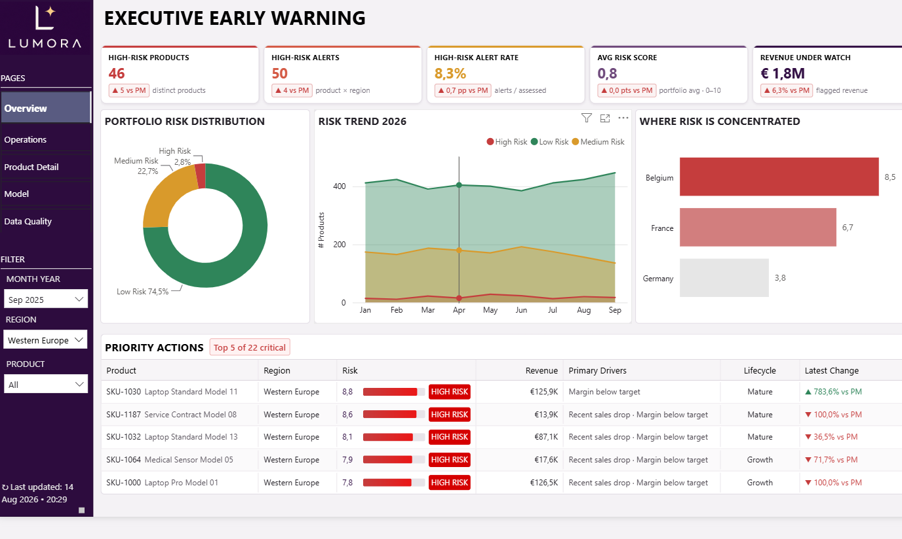
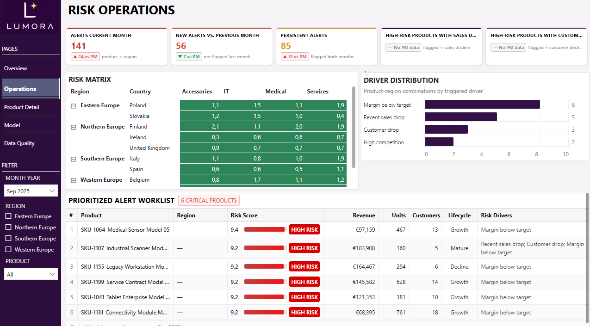
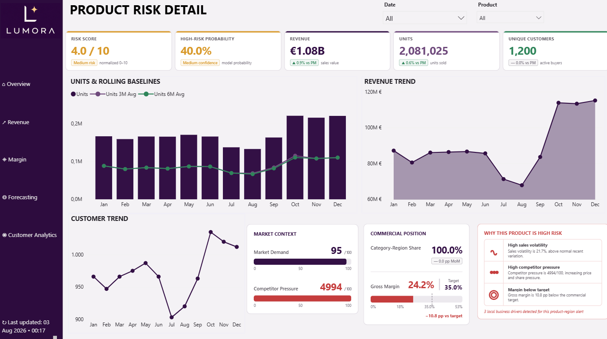
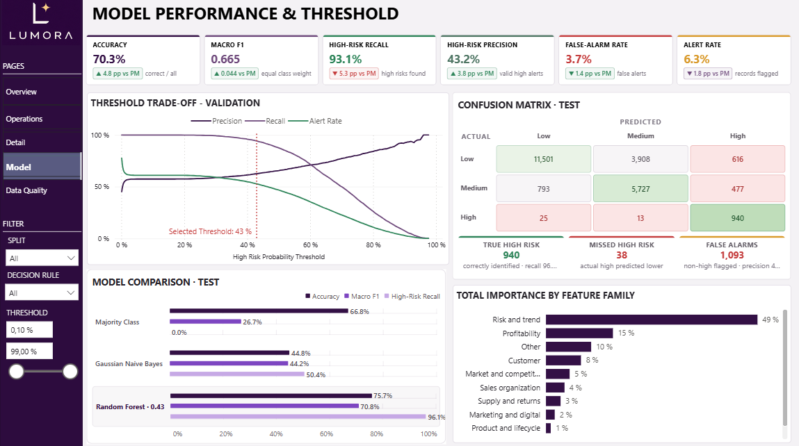
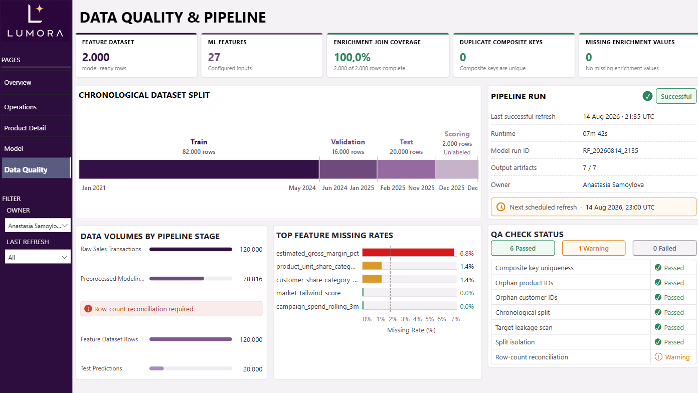

# Early Warning System

An end-to-end data science project that identifies product-region combinations likely to enter **medium or high commercial risk one month in advance**. It combines a python-SQL data pipeline, leakage-safe feature engineering, chronological model evaluation, threshold tuning, model interpretation and Power-BI ready operational outputs.

> **Portfolio project:** The data used in this project is synthetic and was created to represent a realistic multi-market B2B environment. It does not contain confidential company or customer information.

## Business Objective
Commercial deterioration rarely appears in a single KPI. Revenue may still look stable while unit sales, active customers, pipeline activity or market demand are already weakening. This project brings these signals together in an early-warning framework to answer the question: 

> Based on everything known at the end of the current month, which products are most likely to show commercial risk next month—and why?

The resulting risk output helps commercial, sales, supply-chain and portfolio teams:

- identify emerging deterioration before it becomes visible in standard monthly reporting;
- prioritize high-risk products and regions for investigation;
- distinguish sales, customer, profitability, supply, market, and marketing drivers;
- balance high-risk recall against the operational cost of false alerts;
- monitor model performance and data quality in Power BI.

## Project at a glance

| Item | Implementation |
|---|---|
| Prediction grain | One row per product × region × month |
| Prediction point | End of the current month |
| Prediction horizon | One month ahead |
| Target | Low, Medium or High next-month commercial risk |
| Data horizon | January 2021–December 2025 |
| Portfolio | 200 products across 4 regions |
| Analytical panel | 120.000 product–region–month rows |
| Modeling rows | 118.000 labeled rows plus 2.000 current scoring rows |
| Integrated sources | 13 relational business tables |
| Model features | 189 selected features, expanded to 236 encoded inputs |
| Final model | Class-balanced Random Forest |
| Final operating threshold | 0.43 high-risk probability |
| Consumption layer | Power BI-ready risk, alert, monitoring and interpretation tables |

## Project Workflow

## Notebook workflow

| Step | Notebook | Purpose | Main outputs |
|---:|---|---|---|
| 00 | `generating_basis_data` | Generates a reproducible synthetic B2B dataset and validates the relational model | Dimensions, sales, forecasts, inventory, costs, CRM, returns and pipeline tables |
| 01 | `sql_input` | Extracts standardized source tables from SQL Server | Full CSV extracts and reproducible samples |
| 02 | `generating_new_data` | Adds synthetic market and marketing enrichment | `market_signals.csv`, `market_activity.csv`, dictionaries and QA metadata |
| 03 | `preprocessing` | Builds the complete product–region–month panel and creates the one-month-ahead target | Enriched modeling dataset and column dictionary |
| 04 | `feature_engineering` | Creates business-oriented features and train-fitted transformations | Feature catalog, ML-ready train/validation/test/scoring matrices, IDs and QA report |
| 05 | `ml_baseline_portfolio` | Establishes majority-class, Gaussian Naive Bayes and class-weighted logistic-regression benchmarks | Baseline metrics, predictions, model artifacts and feature diagnostics |
| 06 | `ml_random_forest_portfolio` | Selects a Random Forest candidate and tunes the high-risk threshold using validation data | Final models, threshold grid, test predictions, feature importance and confidence intervals |
| 07 | `ml_interpretation_risk_output_portfolio` | Converts model probabilities into explainable, business-ready risk outputs | Dashboard dataset, alert queue, local drivers, recommended actions, monitoring tables and quality report |

## Data Foundation
The base generator creates a relational B2B dataset covering revenue, customers, products, operations and forward-looking commercial activity.

| Data domain | Example information |
|---|---|
| Sales | Revenue, units, ASP, discounts, gross profit and gross margin |
| Customers and Product | Customer segment, size, churn probability, product family, lifecycle stage |
| Inventory | Stock levels, stockouts, backorders and inventory pressure |
| CRM activity | Customer interactions, opportunities and recent sales activity |
| Pipeline | Pipeline value, coverage, conversion |
| Marketing | Campaign activity, channel, engagement |
| Market context | Market demand, competition |

The preprocessing pipeline creates a complete panel for every valid product–region–month combination. Months without transactions remain in the dataset because zero sales can be an important early-warning signal.

## Target definition
The target represents commercial risk in month `t+1`, using outcomes observed one month after the prediction point. Five next-month triggers are evaluated:

1. persistent sales decline
2. material customer decline
3. elevated sales volatility
4. performance materially below the trend-adjusted expectation
5. stockout pressure

The multiclass label is defined as:

| Risk label | Rule |
|---|---|
| Low Risk | Zero or one trigger |
| Medium Risk | Two triggers |
| High Risk | Three or more triggers |

## Feature Engineering
The feature layer combines current-month information available at the prediction point.

Key feature families include:

- **Sales and momentum:** one- and three-month lags, rolling averages, rolling volatility, growth rates, trend slopes, consecutive decline and no-sales flags
- **Peer performance:** category-region revenue share, unit share, percentile and rank
- **Customer health:** active customer count, customer growth, customer concentration, segment mix, churn-risk mix and customer lag features
- **Profitability:** gross margin, cost-based margin, margin gap to target, COGS, discount value and revenue-at-risk proxies
- **Supply and returns:** inventory cover, stockouts, backorders, return pressure and combined supply-pressure scores
- **Market context:** demand growth, competitor pressure, macro conditions, demand shocks, pipeline interest and market opportunity
- **Marketing:** spend efficiency, digital engagement, funnel conversion, campaign history and campaign-to-sales interactions
- **Lifecycle and organization:** product age, lifecycle stage, sales-representative coverage, seniority and quota coverage

The final feature catalog documents every model feature's family, data type, missing rate, timing and leakage status.

## Leakage prevention and validation design
Time leakage is explicitly controlled throughout the project:
- predictions are made after month-end using only information available at that point
- lagged and rolling historical baselines use group-wise shifts so the current observation is excluded from its own history
- future fields are used only to create the target and are never exported as model features
- entity IDs and audit dates are stored separately from the feature matrices
- numeric imputation, scaling, categorical modes and one-hot levels are fitted on the training period only
- unseen validation, test or scoring categories receive an explicit `__UNSEEN__` indicator
- the final month for each product–region history remains unlabeled and is reserved for current scoring
- train, validation and test periods are split by `target_month`, not randomly

| Split | Observation months | Target months | Rows |
|---|---|---|---:|
| Train | Jan 2021–May 2024 | Feb 2021–Jun 2024 | 82,000 |
| Validation | Jun 2024–Jan 2025 | Jul 2024–Feb 2025 | 16,000 |
| Test | Feb 2025–Nov 2025 | Mar 2025–Dec 2025 | 20,000 |
| Current scoring | Dec 2025 | Jan 2026 | 2,000 |

## Model development
3 baselines establish whether the engineered feature set contains useful predictive signal:

- majority-class reference
- Gaussian Naive Bayes as a fast probabilistic signal check
- class-weighted logistic regression as an interpretable linear benchmark

The stronger model stage evaluates several Random Forest configurations with different depths and class-weighting strategies. Candidate selection uses validation high-risk PR-AUC, followed by high-risk F2, macro F1 and log loss.

The selected model uses:

| Parameter | Value |
|---|---|
| Estimators | 220 |
| Maximum depth | 14 |
| Minimum samples per leaf | 3 |
| Features considered per split | Square root |
| Class weighting | `balanced_subsample` |
| Random seed | 42 |

### Threshold tuning
The default multiclass decision rule is supplemented with a dedicated high-risk cutoff. Threshold candidates are evaluated on validation data only. Among thresholds achieving at least 70% high-risk recall, selection prioritizes high-risk F2 then precision and macro F1, while favoring fewer false alarms.

The final threshold is **0.39**.

## Out-of-time test results
The final operating point was evaluated once on the untouched test period.

| Metric | Result |
|---|---:|
**PLACEHOLDER**

The model intentionally prioritizes recall because missing a genuine risk is assumed to be more costly than reviewing an additional alert. Precision, alert volume and false-alarm rate remain visible so this decision can be adapted to operational capacity.

## Model interpretation
The interpretation layer separates model mechanics from business context.

1. **Global impurity importance** shows how often and how effectively features reduce uncertainty across the forest
2. **Validation permutation importance** measures the change in validation macro F1 after shuffling a feature
3. **Local tree-path contributions** decompose the predicted-class probability for every current scoring row.
4. **Business risk indicators** identify recognizable conditions such as sales below trend, customer decline, margin pressure, stockouts, competitor pressure or campaigns that are not converting.

The leading global model features include customer, unit and revenue lags, three-month trend slope, sales volatility, peer share and rolling sales statistics. Risk-and-trend features account for the largest share of overall Random Forest importance.

## Operational risk outputs
The final notebook creates reusable outputs for Power BI and operational workflows.

| Output | Use case |
|---|---|
| `risk_predictions_for_dashboard.csv` | Full historical and current prediction history with probabilities, labels, drivers and monitoring fields |
| `current_scoring_risk_output.csv` | Latest scoring month with business context and recommended actions |
| `current_risk_alert_queue.csv` | Prioritized Medium- and High-Risk review queue |
| `latest_month_top_high_risk_products.csv` | Highest-probability High-Risk products for immediate review |
| `scoring_local_path_contributions.csv` | Ranked local model drivers for current scoring rows |
| `risk_monitoring_by_month.csv` | Monthly alert, recall, precision and probability monitoring |
| `false_alarm_recall_tradeoff.csv` | Threshold sensitivity for operational decision-making |
| `test_high_risk_probability_lift.csv` | Capacity-based ranking and lift analysis |
| `risk_output_feature_importance.csv` | Global feature-importance table |
| `risk_output_quality_report.json` | Final pipeline and output validation checks |

For the current December 2025 scoring month, the model produces predictions for January 2026:

| Predicted class | Rows |
|---|---:|
**PLACEHOLDER**
| **Total** | **2.000** |

The combined operational alert queue contains 1.071 Medium- and High-Risk product–region combinations.

## Power BI reporting layer
The Power BI report converts model outputs into an operational decision-support tool. It includes executive KPIs, prioritization tables, drill-through analysis, model monitoring and data-quality controls.

### Executive Overview
Portfolio-level view of risk, revenue under watch, alert development, priority actions. 

### Risk Operations
Prioritized worklist of high-risk product-region alerts, including commercial exposure, lifecycle, risk score and main drivers.

### Product Risk Details
Drill-through analysis of an individual product-region alert, including recent commercial performance, rolling baselines, market context and local business drivers.

### Model Performance
Model comparison, confusion matrix and monitoring KPIs such as accuracy, Macro F1, high-risk recall, precision, false-alarm rate and alert rate.

### Data Quality
Monitoring of feature coverage, missing enrichment values, duplicate keys and the completeness of the model-scoring dataset.

## Data-quality controls
The notebooks fail early when critical assumptions are violated. Automated checks cover:

- required schemas and ordered output-column contracts
- primary-key uniqueness and intended table grain
- foreign-key integrity and region-compatible assignments
- valid date relationships and no impossible pre-launch activity
- aggregation reconciliation back to source transactions
- join cardinality and enrichment coverage
- complete product–region–month keys
- valid binary flags and target classes
- feature alignment across all model splits
- no missing or infinite values in ML matrices
- chronological split order and leakage exclusions
- probability sums, prediction reproduction, risk-score ranges, and local-explanation reconciliation

## Technology Stack
| Layer | Technologies |
|---|---|
| Data generation and analysis | Python, pandas, NumPy |
| Machine learning | scikit-learn |
| Database | SQL Server, SQL |
| Data modelling | Dimensional model / star schema |
| Business intelligence | Power BI, Power Query, DAX |
| Development | Jupyter Notebook, GitHub |

## Key Project Strengths
- Connects machine-learning output to concrete commercial decisions.
- Combines financial, customer, operational and market data in one analytical model.
- Uses chronological validation and explicit leakage controls.
- Evaluates the model using business-relevant metrics rather than accuracy alone.
- Provides interpretable risk drivers and prioritized alerts instead of isolated predictions.
- Includes model-performance and data-quality monitoring alongside business dashboards.

## Limitations and next steps

- The data and market enrichments are synthetic; real deployment requires validated operational data and business ownership of the target definition
- The target is rule-based and should be reassessed against actual commercial outcomes, intervention costs and review capacity
- Predicted probabilities should be calibrated before they are interpreted as real-world event likelihoods.
- Local tree-path contributions explain the model's mechanics but do not establish causality
- Production use requires drift monitoring, scheduled retraining, access controls, lineage and alert-resolution feedback.

Potential extensions include time-series cross-validation, calibrated probabilities, gradient-boosting benchmarks, SHAP-based explanation, automated orchestration, MLflow-style experiment tracking, and closed-loop outcome capture from the Power BI alert workflow.

## Author
Anastasia Samoylova
M.Sc. | BI & Data Analytics | ML

